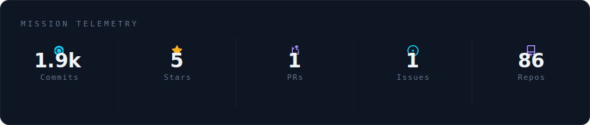

  

 

  

 

  

 

<h2 align="center">💫 About Me</h2>

  🔭 Founder & Lead Developer at <b>Experdata App</b> — building custom enterprise systems with modern cloud-native architecture. 
  🌱 Currently expanding expertise in <b>C# microservices</b>, <b>OPC UA</b> industrial protocols, and <b>cloud-native distributed systems</b>. 
  ⚡ Specialized in fullstack development, real-time data synchronization, and scalable backend architectures.

  

---

### 💻 Tech Stack

**Frontend** 
      

**Backend & APIs** 
     

**Databases** 
      

**Cloud & Infrastructure** 
   

**Storage & Messaging** 
 

**Tools, Libraries & Frameworks** 
       

**Industrial & IoT** 

---

### 📊 GitHub Stats

  
  

  

